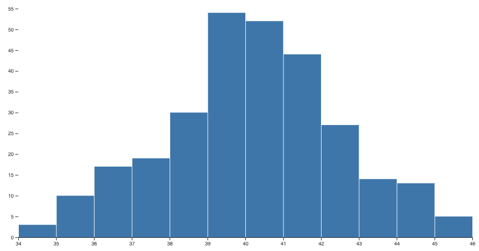

### index2.html is the main html file

# Exercise 1
## Histogram
Clone the repository and make the histogram using utility functions in draw.js file using the data in histogram_data.js file
- Make new file histogram.js and write code there, do not modify draw.js 
- the graph should be in svg2

The histogram should look somewhat like this:

# Exercise 2
## Control plot
### Statistical Process Control Chart

The chart we are creating is known as a **Statistical Process Control (SPC) Chart**, also referred to as a **Control Chart**. It is a fundamental tool used by quality managers in various manufacturing processes.

To illustrate, let's consider a scenario where we are producing chocolate bars with a target weight of 50g and an acceptable error margin of ±3g. Instead of weighing each individual chocolate bar, we take regular intervals of a batch, measure the average weight, and plot it on the control chart.

For the given example:
- Target: 40g
- Lower Control Limit: 37g
- Upper Control Limit: 43g

If the average weight falls outside these control limits, it indicates an issue with the production line. However, even if all values are within the limits, there could still be problems. For instance, if all values are consistently above the target, it suggests the need to adjust the machine, as the bars are consistently too heavy.

For a visual explanation of the process, you can watch this [video](https://www.youtube.com/watch?v=Ugcb7Vlp0Ts).

The plot can be divided into different zones, as shown [here](https://www.sixsigma-institute.org/Six_Sigma_DMAIC_Process_Control_Phase_What_Are_Control_Charts.php).

To implement the control chart effectively, you should follow the 7 rules mentioned [here](https://www.sixsigma-institute.org/Six_Sigma_DMAIC_Process_Control_Phase_SPC_Out_Of_Control.php).

In our exercise, the zones for the control chart will be defined as follows:

| ZONE NAME           | LOWER LIMIT | UPPER LIMIT |
|---------------------|-------------|-------------|
| UPPER CONTROL LIMIT | 43          |             |
| UPPER ZONE A        | 42          | 43          |
| UPPER ZONE B        | 41          | 42          |
| UPPER ZONE C        | 40          | 41          |
| TARGET              | 40          | 40          |
| LOWER ZONE C        | 39          | 40          |
| LOWER ZONE B        | 38          | 39          |
| LOWER ZONE A        | 37          | 38          |
| LOWER CONTROL LIMIT |             | 37          |

These zones provide a structured way to analyze the data and detect any variations or issues in the production process.

The final plot should look something like below 👇
>initially it should look something like below

> on clicking verify rule 1,
> If a point is above or below LCL or UCL

> on clicking verify rule 2,
> if 5 consecutive points are monotonously increasing/decreasing

> on clicking verify rule 3,
> if 6 consecutive points are on either side of target

> on clicking clear

